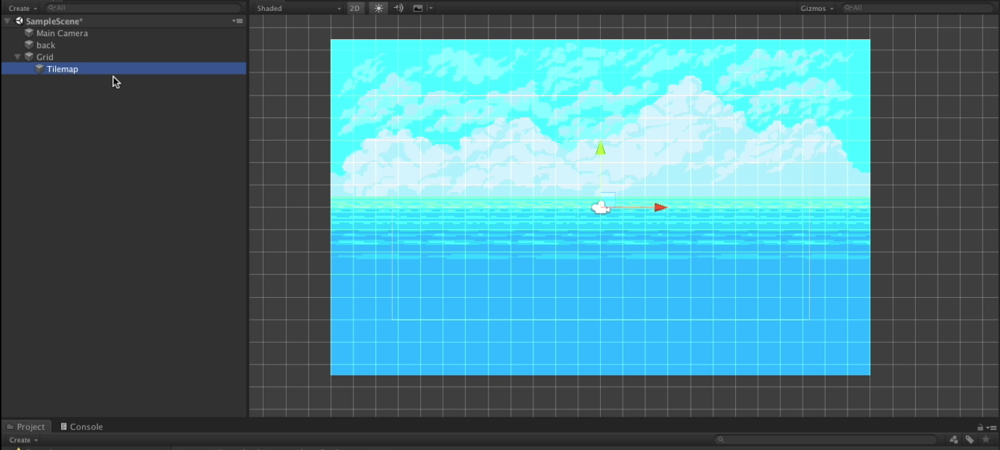
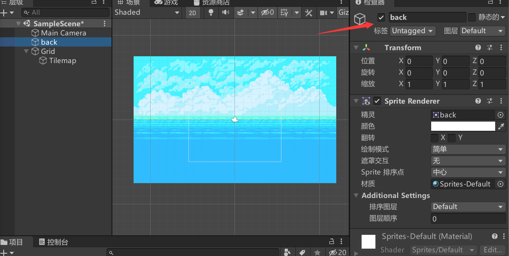
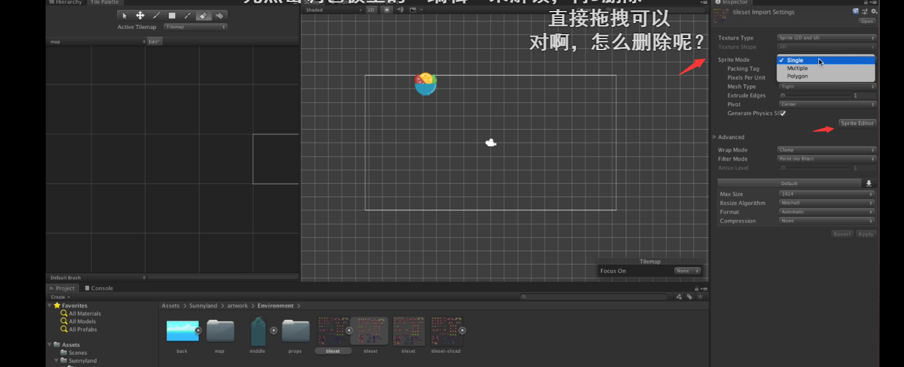
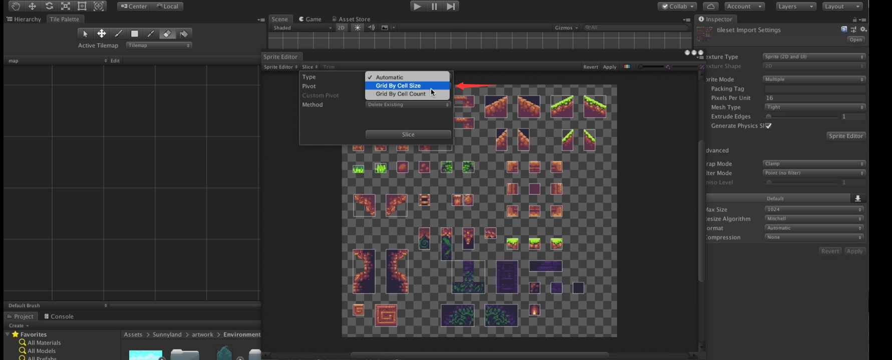
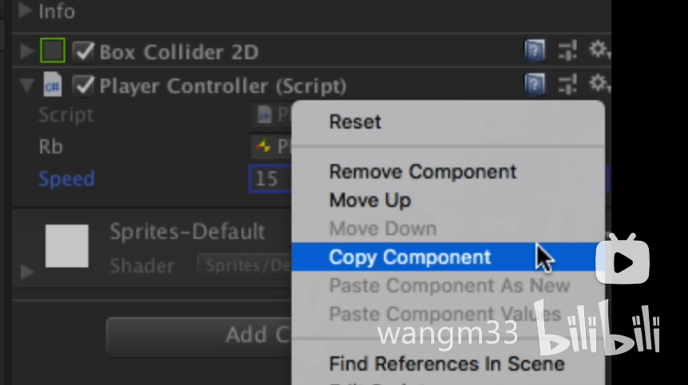

# Unity&小狐狸制作

- 主体页面

  - Project - 文件目录

    位于default界面的的正下方，可以存放各种素材

  - Scene  -游戏画面

    每一个场景

  - Game-游戏

    实操游戏

- 素材获取
  - asset store - 素材商店
    通过asset store，可以下载所需要的素材

- 单元

  单元(Unit)是指每个方格里面有多少个像素点，此次制作我们选择**16**的单元，单元是对于素材所修改的

- 网格

  在创建(+)中找到2D对象中的瓦片地图选择矩形则可以**出现以设置像素为单位的网格**，效果图如下



- 取消显示

  选中scene中任意一个对象，选中如下图，则会隐藏目标

- 切割

  - 平铺调色板

    在***窗口***中移动到2D即可找到***调色面板***

  - 待切割图像

    将待切割图像的像素设置成需要的像素大小

    选中待切割图像在sprite mode调成multiple，并设置需要切割的像素大小，我们可以获得想要切割的部分，如图

    

    我们如果想要细分每个单元的话我们需要在转跳出来的页面选择切割，并且如图，我们可以获得每个切割图形的的单位像素

    

    在调用出的***调色面板***中将所需要切割的图像拖拽到***调色面板***中

    点击保存

- 调整游戏画面

  - 可视比例

    在***游戏***中可调整画面比例，如调成16:9

  - 摄像头观测范围

    在***Main Camera***中调整参数中的***大小***

- 图层排序

  - sorting layer

    越在下面，越在前面

  - order layer

    数字越大越在前，同层级的时候使用

- 创建对象
  - 在下方文件处找到对象模型，拖拽到scence中即可创建
  - 在左方右键创建sprite。将对象模型拖拽到 sprite(精灵)

- 添加组件—Add Component

  - 2d刚体—rigibody 2d

    添加后让目标成为实体，赋有重力等物理量

  - 2d碰撞体—box collider 2d

    添加后对目标在一定范围内拥有碰撞效果

  - 2d地图碰撞格子—tilemap collider 2d

    添加后对地图中所有填充过的区域进行碰撞体化

- 整体控制更改
  - Edit(编辑)中Project Setting - input(输入管理)可以更改

- 自主添加脚本

  - add Component
    new script可以命名，会自动创建一个C#的脚本，这个脚本将创建在Assets中

  - 管理

    为了更好的管理脚本，我们可以创建一个文件夹，存放脚本

- 移动

  - public Rigidbody2D rb; 定义刚体。可以手动在图形编辑器里拖进去添加到对象的组件中

  - Input.GetAxis(Horizontal); 获取横轴变更

  -  rb.velocity = new Vector2(horizontalMove * speed, rb.velocity.y); 设置对象位置

  - 详细设置讲解

    ```c#
    using System.Collections;
    using System.Collections.Generic;
    using UnityEngine;
    
    public class PlayerController : MonoBehaviour
    {
        public Rigidbody2D rb;//申明公开一个变量为刚体，具体会出现在程序可添加的那边，我们可以自行拖拽一个刚体，则这个刚体受程序的控制
        public float speed;
    
        // Start is called before the first frame update
        void Start()//希望在游戏开始的时候就被加载的脚本
        {
            
        }
    
        // Update is called once per frame
        void Update()//希望在游戏每一帧的时候都更新
        {
            Movement();
        }
        void Movement()
        {
            float Horizontalmove;//获得下面的参数
            Horizontalmove = Input.GetAxis("Horizontal");//在input(里面有控制人物移动的东西)中获取(get)Axis(Axes的复数)。当你按下←或者→时会输出-1或者1，因此我们在上面定义一个变量，来获取这个参数。
            if (Horizontalmove != 0) {
                rb.velocity = new Vector2(Horizontalmove * speed, rb.velocity.y);//这里是真正实现坐标变化也就是移动的程序。new创造了一个新的变量Vector2(用于控制2D的速度)，其中V2是需要2个量的，即(横向速度，纵向速度)
            }
        }
    }
    ```
    

- 锁定方向

  将刚体 Constrants 里的 z 勾选，让它不会飞起来

- 修改参数

  在我们试玩的时候修改public中的参数参数不会e保存，此时我们要在脚本中右边的齿轮点击copyComponent，即可复制参数。在结束试玩的时候可以再次点击齿轮选择Paste Component Value

- 改变朝向

  在scale(缩放)控制面朝的方向，1为正，-1为反面。

  - float facedirection = Input.GetAxisRaw(Horizontal); 直接获得  -1，0，1  获取整数(GetAxisRaw是只能获取-1 0 1没法渐变数值，而GetAxis是一个平滑的渐变数值)
  - transform.localScale = new Vector3(facedirection, 1, 1); 设置方向

​		代码添加原理如左右移动

- 保证不同帧率正常

  - Update 函数改为 FixedUpdate() 函数，为固定每0.02s执行一次

  - rb.velocity = new Vector2(horizontalMove * speed * Time.deltaTime, rb.velocity.y); 速度乘以一个时间参数

    为什么要乘一个时间参数呢？

    这个程序是放在`update`或者是`fixedupdate`中的，本来就是指每帧执行一次这个指令，如果不乘一个`Time.deltaTime`，本身这个程序就是不符合逻辑的，因为我们想要的假如有speed为10，是想指速度每秒为10，但是实际上是(帧数)*10，因为每1帧都执行了一次speed为10的指令，改变的位置也就成为理应有的(帧数)倍。

- 跳跃
  - Input.GetButtonDown(Jump) ；获取跳跃按键
  - rb.velocity = new Vector2(rb.velocity.x, jumpforce * Time.deltaTime); 改变y轴方向
  - Rigidbody2D 中的GravityScale 参数同样可以调整跳跃力度(施加重力)

- 左右移动动画

  - 添加组件

    Animator(动画器)，需要一个controller来驱动

  - 控制器

    创建一个animation controller(动画器控制器)

    将animation controller拖拽到animator的controller之中

  - 打开动画器面板

    window - Animation - Animation

    可以将你需要的动画拖拽进动画器面板来实现动画

    运用Smaples或者拖拽图片 设置动画速率

  - 逻辑控制器

    window - Animation - Animator(动画器)

    对动画可以设置逻辑关系，何时该做何事

    右键animator中动画方块选择make transition(创建过渡)可以创建箭头

    箭头的参数在animator中选择

    在conditions(条件)中可以设置逻辑关系，例如当running＞0.1时是idle指向running；当running＜0.1时是running指向idle

    动作切换的时候我们如果不需要一个过渡则  去掉  Has Exit Time      Transition Duration 设置成 0

  - 控制代码

    运用代码来控制running的数值,如

    ```c#
     anim.SetFloat("running", Mathf.Abs(facedirection));
    ```

    anim中的float中的running这个变量的值是facedirection的绝对值

    这里刚刚好可以用到当不动的时候facedirection=0 动的时候facedirection=1或者-1

    facedirection刚刚好改变了面向，从而播放动画也会按照面向播放


- 跳跃降落动画

  - 导入跳跃动画 逻辑

    和左右移动动画的导入一样

  - 布尔形

    true or false

  - 整体思路

    我们需要在站立idle或者跑步running的时候可以当跳跃为true的时候启动跳跃

    当我们降落falling的时候跳跃为false 降落为true

    当回到地面的时候我们需要站立idle 此时falling为false idel为true

  - 程序

    `public LayerMask ground;`公开了一个叫ground的layermask，作用是获得属于地面的信息

    `public Collider2D coll;`公开了一个叫coll的Collider 2D，作用是获得角色的刚体
    `if (anim.GetBool("jumping"))`如果我们按下jump这个键，jumping就是true`if (anim.GetBool("jumping"))`

    如果在空中的过程中，竖直速度降为0那么jumping为false falling为true`anim.SetBool("jumping", false);` `anim.SetBool("falling", true);`

    否则的话当狐狸的刚体碰撞到地面这个图层的时候falling为false idle为true` anim.SetBool("falling", false);` `anim.SetBool("idle", true);`

    ```c#
    if (anim.GetBool("jumping"))
            {
                if (rb.velocity.y < 0)
                {
                    anim.SetBool("idle", false);
    
                    anim.SetBool("jumping", false);
                    anim.SetBool("falling", true);
                }
            }else if (coll.IsTouchingLayers(ground))
                {
                    anim.SetBool("falling", false);
                    anim.SetBool("idle", true);
                }
        }
    ```

- bug修复-游玩卡顿

  遇到游玩突然前进不了的时候

  需要为玩家添加一个圆形刚体，同时将矩形刚体缩小

- private私有

  private一个变量的时候那个变量无法调试，可以用来私有component(组件)

  同时在游戏一开始(`void start()`)中将组件加载,例如

  ```c#
  rb=GetComponent<Rigbody2D>();
  ```

- 控制角色镜头

  - 创建新脚本

    添加脚本组件取名CameraController控制镜头

    脚本

    在游戏里更新的每一帧都更新

    ```c#
    public Transform player;//公开一个读取的Transform，我们想要读取player的transform
    
    void Start(){
        transform.position = new Vector3 (player.position.x,player.position.y,-10f)//让摄像头的位置设为玩家的位置
    ```
    

  - 添加Cinemachine控制镜头
  
    对背景添加 Polygon Colider2d(多边形刚体)     勾选isTriger(可以让物体不发生碰撞)
  
    添加Cinemachine Confiner(在最下方的Add Extension中)  
  
    填入 Polygon
  
    Lens- Orthographic Size 设置镜头大小

