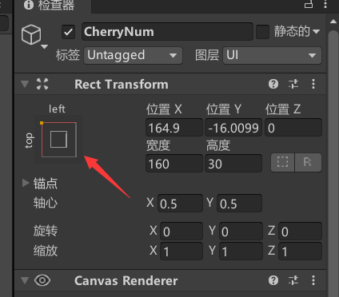

# Unity&小狐狸制作

- 主体页面

  - Project - 文件目录

    位于default界面的的正下方，可以存放各种素材

  - Scene  -游戏画面

    每一个场景

  - Game-游戏

    实操游戏

- 素材获取
  - asset store - 素材商店
    通过asset store，可以下载所需要的素材

- 单元

  单元(Unit)是指每个方格里面有多少个像素点，此次制作我们选择**16**的单元，单元是对于素材所修改的

- 网格

  在创建(+)中找到2D对象中的瓦片地图选择矩形则可以**出现以设置像素为单位的网格**，效果图如下


- 取消显示

  选中scene中任意一个对象，选中如下图，则会隐藏目标

- 切割

  - 平铺调色板

    在***窗口***中移动到2D即可找到***调色面板***

  - 待切割图像

    将待切割图像的像素设置成需要的像素大小

    选中待切割图像在sprite mode调成multiple，并设置需要切割的像素大小，我们可以获得想要切割的部分，如图

    

    我们如果想要细分每个单元的话我们需要在转跳出来的页面选择切割，并且如图，我们可以获得每个切割图形的的单位像素

    

    在调用出的***调色面板***中将所需要切割的图像拖拽到***调色面板***中

    点击保存


- z轴

  z轴可以调整在3D中的Z位置，2D游戏是在3D游戏正投影下所看到的，因此有可能会出现遮挡现象

- 调整游戏画面

  - 可视比例

    在***游戏***中可调整画面比例，如调成16:9

  - 摄像头观测范围

    在***Main Camera***中调整参数中的***大小***

- 图层排序

  - sorting layer

    越在下面，越在前面

  - order layer

    数字越大越在前，同层级的时候使用

- 创建对象
  - 在下方文件处找到对象模型，拖拽到scence中即可创建
  - 在左方右键创建sprite。将对象模型拖拽到 sprite(精灵)

- 添加组件—Add Component

  - 2d刚体—rigibody 2d

    添加后让目标成为实体，赋有重力等物理量

  - 2d碰撞体—box collider 2d

    添加后对目标在一定范围内拥有碰撞效果

  - 2d地图碰撞格子—tilemap collider 2d

    添加后对地图中所有填充过的区域进行碰撞体化

- 整体控制更改
  - Edit(编辑)中Project Setting - input(输入管理)可以更改

- 自主添加脚本

  - add Component
    new script可以命名，会自动创建一个C#的脚本，这个脚本将创建在Assets中

  - 管理

    为了更好的管理脚本，我们可以创建一个文件夹，存放脚本

- 移动

  - public Rigidbody2D rb; 定义刚体。可以手动在图形编辑器里拖进去添加到对象的组件中

  - Input.GetAxis(Horizontal); 获取横轴变更

  -  rb.velocity = new Vector2(horizontalMove * speed, rb.velocity.y); 设置对象位置

  - 详细设置讲解

    ```c#
    using System.Collections;
    using System.Collections.Generic;
    using UnityEngine;
    
    public class PlayerController : MonoBehaviour
    {
        public Rigidbody2D rb;//申明公开一个变量为刚体，具体会出现在程序可添加的那边，我们可以自行拖拽一个刚体，则这个刚体受程序的控制
        public float speed;
    
        // Start is called before the first frame update
        void Start()//希望在游戏开始的时候就被加载的脚本
        {
            
        }
    
        // Update is called once per frame
        void Update()//希望在游戏每一帧的时候都更新
        {
            Movement();
        }
        void Movement()
        {
            float Horizontalmove;//获得下面的参数
            Horizontalmove = Input.GetAxis("Horizontal");//在input(里面有控制人物移动的东西)中获取(get)Axis(Axes的复数)。当你按下←或者→时会输出-1或者1，因此我们在上面定义一个变量，来获取这个参数。
            if (Horizontalmove != 0) {
                rb.velocity = new Vector2(Horizontalmove * speed, rb.velocity.y);//这里是真正实现坐标变化也就是移动的程序。new创造了一个新的变量Vector2(用于控制2D的速度)，其中V2是需要2个量的，即(横向速度，纵向速度)
            }
        }
    }
    ```
    

- 锁定方向

  将刚体 Constrants 里的 z 勾选，让它不会飞起来

- 修改参数

  在我们试玩的时候修改public中的参数参数不会e保存，此时我们要在脚本中右边的齿轮点击copyComponent，即可复制参数。在结束试玩的时候可以再次点击齿轮选择Paste Component Value

- 改变朝向

  在scale(缩放)控制面朝的方向，1为正，-1为反面。

  - float facedirection = Input.GetAxisRaw(Horizontal); 直接获得  -1，0，1  获取整数(GetAxisRaw是只能获取-1 0 1没法渐变数值，而GetAxis是一个平滑的渐变数值)
  - transform.localScale = new Vector3(facedirection, 1, 1); 设置方向

​		代码添加原理如左右移动

- 保证不同帧率正常

  - Update 函数改为 FixedUpdate() 函数，为固定每0.02s执行一次

  - rb.velocity = new Vector2(horizontalMove * speed * Time.deltaTime, rb.velocity.y); 速度乘以一个时间参数

    为什么要乘一个时间参数呢？

    这个程序是放在`update`或者是`fixedupdate`中的，本来就是指每帧执行一次这个指令，如果不乘一个`Time.deltaTime`，本身这个程序就是不符合逻辑的，因为我们想要的假如有speed为10，是想指速度每秒为10，但是实际上是(帧数)*10，因为每1帧都执行了一次speed为10的指令，改变的位置也就成为理应有的(帧数)倍。

- 跳跃
  - Input.GetButtonDown(Jump) ；获取跳跃按键
  - rb.velocity = new Vector2(rb.velocity.x, jumpforce * Time.deltaTime); 改变y轴方向
  - Rigidbody2D 中的GravityScale 参数同样可以调整跳跃力度(施加重力)

- 左右移动动画

  - 添加组件

    Animator(动画器)，需要一个controller来驱动

  - 控制器

    创建一个animation controller(动画器控制器)

    将animation controller拖拽到animator的controller之中

  - 打开动画器面板

    window - Animation - Animation

    可以将你需要的动画拖拽进动画器面板来实现动画

    运用Smaples或者拖拽图片 设置动画速率

  - 逻辑控制器

    window - Animation - Animator(动画器)

    对动画可以设置逻辑关系，何时该做何事

    右键animator中动画方块选择make transition(创建过渡)可以创建箭头

    箭头的参数在animator中选择

    在conditions(条件)中可以设置逻辑关系，例如当running＞0.1时是idle指向running；当running＜0.1时是running指向idle

    动作切换的时候我们如果不需要一个过渡则  去掉  Has Exit Time      Transition Duration 设置成 0

  - 控制代码

    运用代码来控制running的数值,如

    ```c#
     anim.SetFloat("running", Mathf.Abs(facedirection));
    ```

    anim中的float中的running这个变量的值是facedirection的绝对值

    这里刚刚好可以用到当不动的时候facedirection=0 动的时候facedirection=1或者-1

    facedirection刚刚好改变了面向，从而播放动画也会按照面向播放


- 跳跃降落动画

  - 导入跳跃动画

    逻辑和左右移动动画的导入一样

  - 布尔形

    true or false

  - 整体思路

    我们需要在站立idle或者跑步running的时候可以当跳跃为true的时候启动跳跃

    当我们降落falling的时候跳跃为false 降落为true

    当回到地面的时候我们需要站立idle 此时falling为false idel为true

  - 程序

    `public LayerMask ground;`公开了一个叫ground的layermask，作用是获得属于地面的信息

    `public Collider2D coll;`公开了一个叫coll的Collider 2D，作用是获得角色的刚体
    `if (anim.GetBool("jumping"))`如果我们按下jump这个键，jumping就是true`if (anim.GetBool("jumping"))`

    如果在空中的过程中，竖直速度降为0那么jumping为false falling为true`anim.SetBool("jumping", false);` `anim.SetBool("falling", true);`

    否则的话当狐狸的刚体碰撞到地面这个图层的时候falling为false idle为true` anim.SetBool("falling", false);` `anim.SetBool("idle", true);`

    ```c#
    if (anim.GetBool("jumping"))
            {
                if (rb.velocity.y < 0)
                {
                    anim.SetBool("idle", false);
    
                    anim.SetBool("jumping", false);
                    anim.SetBool("falling", true);
                }
            }else if (coll.IsTouchingLayers(ground))
                {
                    anim.SetBool("falling", false);
                    anim.SetBool("idle", true);
                }
        }
    ```

- bug修复-游玩卡顿

  遇到游玩突然前进不了的时候

  需要为玩家添加一个圆形刚体，同时将矩形刚体缩小

- private私有

  private一个变量的时候那个变量无法调试，可以用来私有component(组件)

  同时在游戏一开始(`void start()`)中将组件加载,例如

  ```c#
  rb=GetComponent<Rigbody2D>();
  ```

- 控制角色镜头

  - 创建新脚本

    添加脚本组件取名CameraController控制镜头

    脚本

    在游戏里更新的每一帧都更新

    ```c#
    public Transform player;//公开一个读取的Transform，我们想要读取player的transform
    
    void Start(){
        transform.position = new Vector3 (player.position.x,player.position.y,-10f)//让摄像头的位置设为玩家的位置
    ```
    
  - 添加Cinemachine控制镜头

    对背景添加 Polygon Colider2d(多边形刚体)     勾选isTriger(可以让物体不发生碰撞)

    在上方添加Cinemachine选择Create 2Dcamera

    添加Cinemachine Confiner(在最下方的Add Extension中)  

    填入 Polygon
    
    Lens- Orthographic Size 设置镜头大小

- 创建Collection收藏物

  - 创建物品的 Object  动画(方法和player的动画一样)

  - 拾取效果  在 PlayerController void OnTriggerEnter2D(Collider2D collision) 方法里
     注意，物品的istrigger 要勾选上

  - 标记tag

    将樱桃的标签改为collection

  - 代码

    ```c#
    private void OnTriggerEnter2D(Collider2D collision)//如果一个2D碰撞体进入的触发器
        {
            if (collision.tag == "Collection")//碰撞的这个collision的标签是Collection
            {
                Destroy(collision.gameObject);//则销毁物品
                Cherry += 1;//前置的计数+1
            }
    ```

  - 注意如果狐狸的2个碰撞都碰到了cherry，那么计数会＋2

- 创建一个Perfabs文件夹防止重复利用 object

  在后续如关卡制作中我们可以重复利用里面已经做好的模型，在里面修改的时候所有模型也会更改。

- 环境

  直接添加新的对象或者拖拽你想添加的环境

  我们创建更多图层，利用Layer层级调整显示效果，以便对环境更好的更改

- 设置物理效果

  在游戏的过程中我们遇到了蹭边不掉落情况，是因为player的物理材质拥有摩擦导致。

  我们可以创建一个没有摩擦的物理效果
  create - physic Materail 2D 中设置 Friction 0

  将它设置到Player的 Box Collider 2D

- 取消超级跳

  给予判断当碰撞到地面的时候才给予跳跃

  根据 coll.IsTouchingLayers(grouder) 判断触地

- UI入门

  - 创建UI

    右键创建UI中的canvas(画布)，所有的UI需要在canvas之中创建

  - 计数

    创建一个text(文本)类型的UI(之中可以设置一些参数)

    在脚本里面公开一个text类型的变量，拖拽这个text来调用它

  - 代码

    ```c#
    using UnityEngine.UI;//使用unity的UI前置，才可以创建Text的类
    public Text CherryNum;//公开一个text类型的变量
    private void OnTriggerEnter2D(Collider2D collision)
        {
            if (collision.tag == "Collection")
            {
                Destroy(collision.gameObject);
                Cherry += 1;
                CherryNum.text = Cherry.ToString();//让CherryNum中的text=Cherry
            }
        }
    ```

  - 固定位置

    如图



在这里可以调整UI的相对位置，也就是与相对的位置

- 敌人

  - 创建敌人

    利用sprite创建敌人

  - 敌人属性

    我们需要敌人有重力添加rigbody

    我们需要敌人会和角色发生碰撞添加collider 2D

  - 代码

    ```c#
     private void OnCollisionEnter2D(Collision2D collision)//私有一个对Collision发生碰撞的时候触发
        {
            if (anim.GetBool("falling"))//设置角色降落时才能触发
            {
                if (collision.gameObject.tag == "Enemy")//如果触发的对象的标签是Enemy(注意这里和tag是gameObject里面的)
                {
                    Destroy(collision.gameObject);//消灭敌人
                    rb.velocity = new Vector2(rb.velocity.x, jumpforce);//给予跳跃效果
                    anim.SetBool("jumping", true);//给予跳跃动作
                }
            }
        }
    ```


- 设置受伤状态

  受伤状态我们分为两步，一是水平碰到敌人会被反弹；二是设置受伤动画

  - 反弹

    当我们受伤的时候会对小狐狸施加一个向左或者向右的力

    - 代码

      ```c#
      //设置受伤是否
      private bool isHurt;
      //碰到敌人后反弹
      else if (transform.position.x < collision.gameObject.transform.position.x)
      {
          rb.velocity = new Vector2(-10f, rb.velocity.y);
          isHurt = true;
          anim.SetBool("hurt", true);
      }
      else if (transform.position.x > collision.gameObject.transform.position.x)
      {
          rb.velocity = new Vector2(10f, rb.velocity.y);
          isHurt = true;
          anim.SetBool("hurt", true);
      }
      //先判断角色与敌人碰撞时的相对位置，再给予力
      void Update()
      {
          if (isHurt != true) //设置受伤的时候不能移动，也就是不受伤的时候才能移动
          {
              Movement();
          }
      ```

  - 动画

    在`//改变动画`里面设置

    ```c#
    else if (isHurt)
            {
                if (Mathf.Abs(rb.velocity.x) < 0.1f)//当速度小于多少的时候才可以移动
                {
                    isHurt = false;//受伤状态取消
                    anim.SetBool("hurt", false);//把受伤动画的布尔值设置成false
                    anim.SetBool("idle", true); //把站立动画的布尔值设置成true
                }
            }
    ```

  
  
- AI敌人移动

​	设置敌人的AI我们有几个问题要解决

1. 敌人运动的范围			

2. 敌人朝向以及适配的运动方向

   - 敌人运动范围代码及其移动

     ```c#
     //导入左右点坐标
     public Transform leftpoint, rightpoint;
     //预设获取参数名字
     private float leftx, rightx;
     void Start()
     {//获得左右坐标点
         leftx = leftpoint.transform.position.x;
         rightx = rightpoint.transform.position.x;
     }
      void Movement()
      {
          //如果面朝左边
          if (faceleft)
          {
              //forg的速度设置为负方向
              rb.velocity = new Vector2(-speed, rb.transform.position.y);
              //如果说他的位置超过了左点
              if (rb.transform.position.x < leftx)
              {
                  //转向 
                  rb.transform.localScale = new Vector3(-1, 1, 1);
                  //朝右
                  faceleft = false;
              }
          }
          //朝右
          else
          {
              rb.velocity = new Vector2(speed, rb.transform.position.y);
              if (rb.transform.position.x > rightx)
              {
                  rb.transform.localScale = new Vector3(1, 1, 1);
                  faceleft = true;
              }
          }
      }
     
     ```

- 销毁子项目

  游戏时子项目会继承父项目的参数(如坐标)，为了不让其随父项目而改变我们可以用一下手段

  1. 游戏开始时`transform.DeathChildren()`
  2. 游戏开始时保存坐标后摧毁该对象

- 动画事件(event)

  动画事件是指对动画添加一个事件，并且到对应的时间时执行他

  在animator中第二行最右边是添加事件，事件的内容可以是函数

- 类

  类可以在不同代码间引用，例如，假设我们有一个类叫做Enemy

  ```c#
  public class Enemy_eagle : MonoBehaviour;
  //我们只要将MonoBehaviour改成Enemy，那么Enemy_eagle就属于Enemy这类，并成为Enemy的"子"
  ```

  - 父与子

    子可以调用所属父的代码，但是需要在函数前面假如protected以表示在是在父子之间受保护的，例如

    ```c#
    //父
    protected void Start()
        {
            anim = GetComponent<Animator>();
        }
    //子
    protected void Start()
        {
        //表示是引用(基于)父的start
            base.Start();
     	}
    ```

  - 重载与虚拟

    如果我们想让所有子类的方法都由父类来执行，我们需要用到重载与虚拟
    
    - override(重载)与virtual(虚拟)
    
      override(重载)是所需要读写的方法
    
      virtual(虚拟)是所要被重载的对象，由于是虚拟的，所以是一个变量
    
      例如：
    
      ```c#
      //子类
      protected override void Start();
      //父类
      protected virtual void Start();
      ```
    

- 音效(Audio)

  添加组件Audio Source，将音频文件拖拽到Audio Clip中

  .play为播放音频

- 修改prefabs

  要注意在右上角的overrides修改

- 对话框

  添加UI-画板(Panel)，并添加text

  - 触发对话

    利用House的collision作为trigger来触发,也就是我们要在House中写代码，并且读取Dialogue的GameObject

  - 代码

    ```c#
    public class EnterHouse_Dialogue : MonoBehaviour
    {
        //获得Dialogue的所有组件
        public GameObject enterDialogue;
        //触发碰撞，激活对话框
        private void OnTriggerEnter2D(Collider2D collision)
        {
            if(collision.tag == "Player")
            {
                enterDialogue.SetActive(true);
            }
        }
        //离开，关闭对话框
        private void OnTriggerExit2D(Collider2D collision)
        {
            if (collision.tag == "Player")
            {
                enterDialogue.SetActive(false);
            }
        }
    }
    ```

- 制作动画
  add Animation
  点击录制按钮，设置不同帧的样式，每一帧即你所改动的所有内容。

- 检查碰撞

  可以给角色设置一个点，通过获取该点的坐标，在它半价多少格内有所设置的图层。

  - 运用函数

    ```c#
    Physics2D.OverlapCircle()
    ```

- 游戏死亡重开

  添加一个DeadLine让狐狸碰撞到的时候重开

  - 重载游戏

    头文件:`using UnityEngine.SceneManagement;`

  - 代码

    ```c#
     void Restart()
    { 						
         SceneManager.LoadScene(SceneManager.GetActiveScene().name);//获取该加载场景的名字并重载该场景
    }
    ```

- 进入下一场景

  - 代码

    ```c#
    void Update()
        {
            if (Input.GetKeyDown(KeyCode.E))//按下关键键E触发
            {
                SceneManager.LoadScene(SceneManager.GetActiveScene().buildIndex+1);//读取场景的INDEX加1
            }
        }
    ```


- 光线

  - 使环境变暗

    选中背景中所有的元素，在Tilemap Renderer的材质中选选择Diffuse

    运用定向光调整参数

  - 使人物变暗

    自己创建一个材料，选择Shader中的Sprite为Diffuse,并将创建的材料拖拽到Player中的Sprite Renderer中。

  - 使环境物品/角色变亮

    创建灯光选中其中的点光源，调整Z轴位置，调整XY位置

    在角色中创建点灯光，子项目会随父项目移动


- 制作视觉差

  - 视差简单来说就是远中近景色相对于角色摄像头位置的速度

  - 代码

    ```c#
    public class Parallax : MonoBehaviour
    {
        public Transform Cam;//获得摄像头的坐标，他会随着当前的位置改变
        public float movementRate;//设置相对速度比率
        private float startPointX,startPointY;//获取开始的摄像头点位
        public bool lockY;//false//对于Y是否要有类似效果
    
        void Start()
        {
            startPointX = transform.position.x;
            startPointY = transform.position.y;
        }
    
        void Update()
        {
            if(lockY)
            transform.position = new Vector2(startPointX + Cam.position.x * movementRate, transform.position.y);
            //设置运动速率
            else
            {
                transform.position = new Vector2(startPointX + Cam.position.x * movementRate, startPointY+Cam.position.y*movementRate);
            }
        }
    }
    ```


- 二段跳跃

  设置跳跃次数，每跳一次减少一次次数，当触碰的地面的时候恢复次数，当有跳跃次数的时候才能起跳。

- 单向平台

  给tilemap增加组件Platform Effector 2D，可以在Tilemap Collider2D里面勾选Used by Effector

  启用Mask则可以下落(目前下落不了的原因尚不清楚)；

- 敌人死亡

  因为每个敌人都会死亡，因此我们需要创建一个类，来调用这个类的共同方法给所有敌人。

  - 问题1：敌人死亡的时候如果能在动画播放的时候再次踩到敌人，导致重复播放动画，如何解决。

    方法：将敌人的碰撞体关闭，这样敌人就无法和角色碰撞`GetComponent<Collider2D>().enabled = false;`

  - 问题2：敌人如果没有碰撞体了那么它就会不会与地形碰撞，导致动画播放的时候不正常的掉落。

    方法：物体的质量仍然存在，其本质原因是还存在rigbody，摧毁rigbod即可`Destroy(GetComponent<Rigidbody2D>());`

  - 问题3：敌人死亡的时候仍会调用Movement，但是rigboy已经销毁，导致报错。

    方法：做一个bool值来判断是否敌人已经是被踩了，如果没被踩，才调用Movement，同时这也能让敌人不动。

- 新-碰撞体

  在完成一个角色的时候一般会有2个碰撞体，一个用来移动，一个用来防止蹭边摩擦。

  - 问题1：角色会突然卡在一个地方过不去，是为什么。

    方法：在tilemap中每一个格子都有一个独立的碰撞体，在接壤的时候会有缝隙，导致角色如果使用直边碰撞体会卡主。那么可以用曲边碰撞体(圆形或者胶囊)来防止卡住。

  - 问题2：角色会在卡在墙上可以无限跳。

    方法：在碰撞体中如果他的材质是粗糙的，那就会和地图的碰撞体发生摩擦，导致卡在墙上。我们可以为角色增添一个新的材质，让这个材质先于问题1中方法的材质，并将他设置成0摩擦的，这样就不会卡墙了。

  - 问题3：在设置下蹲的时候，改变offset我们可以将他除2，我们想要的效果是上面在原有的碰撞体上除2保留下面的，但是实际操作为什么却是保留上面的呢？

    方法：除2保留下面是当offset的值为正的时候，如果是负的话则会保留上面的。正确做法应该是乘2。

- 改变碰撞体大小

  我们需要提前存一个原有的量，再弄一个改变之后的量，用`getComponment<Collider2D>().size = `来进行赋值

- 制作主菜单

  1. 所有的界面都需要在Canvas之中呈现，所以我们需要新建canvas
  2. 我们需要准备2个panel，一个panel来存放背景图片，一个panel来存放按钮和标题

  - 附加内容

    1. 字体随着屏幕大小等比变化

       在Canvas之中有UI缩放模式，选择“屏幕大小缩放”

    2. 按钮正常 高亮 选中

       在按钮中可以调整其正常 高亮 选中等不同的颜色，以达到效果

    3. 开始，退出游戏

       为Menu添加脚本，使用SceneManager来调整场景变换(记得在buildsetting中添加该场景)

       用`Application.Quit();`即可退出游戏

    4. 控制其他地方的inspector

       其格式如`GameObject.Find(在层级中的路径).你想要控制的;`，如

       ```c#
       GameObject.Find("Canvas/MainMenu/UI").SetActive(true);
       //找到一个物品，它处于该场景层级中的"Canvas/MainMenu/UI"，把他的显示设为"true"
       ```


- TMP使用

  ```c#
  //使用TMP的头文件
  using TMPro;
  //更改TMP的text中的内容
  (GameObject).GetComponent<TMP_Text>().text = (String)
  ```

  

