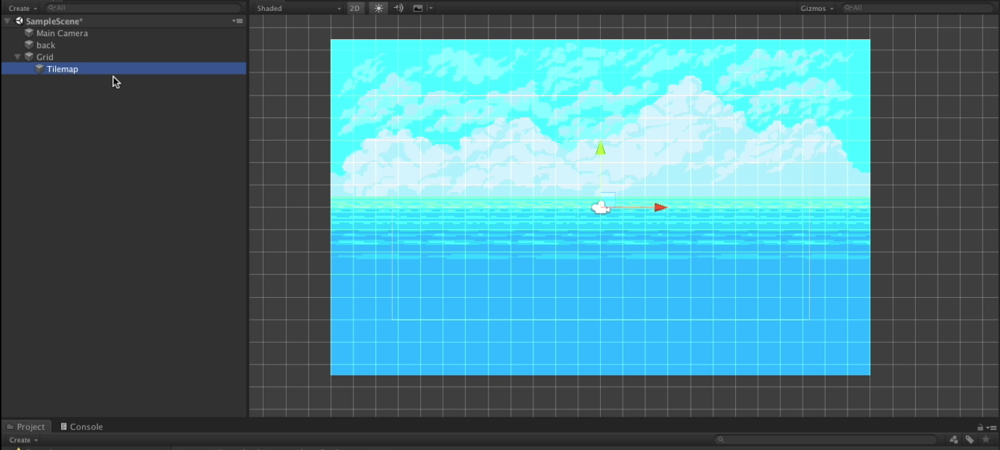
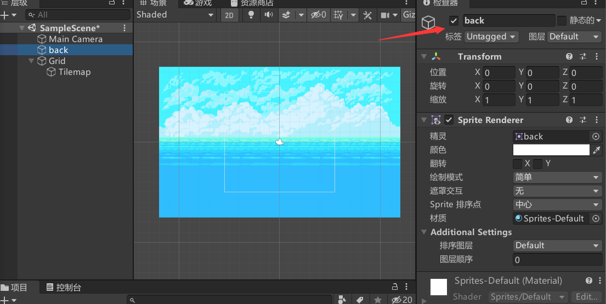
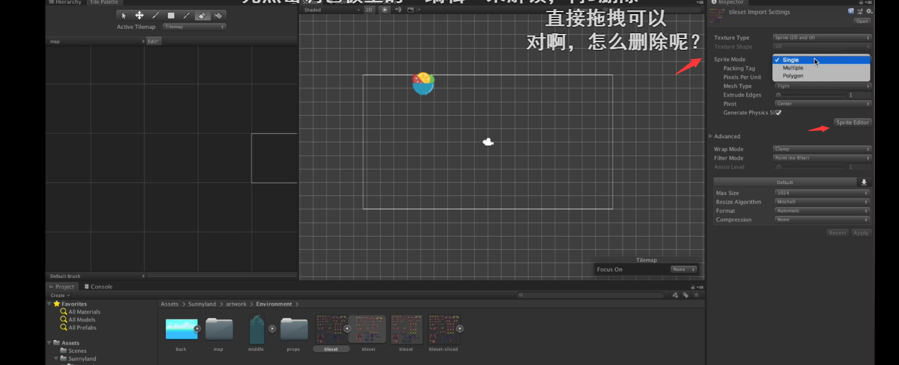
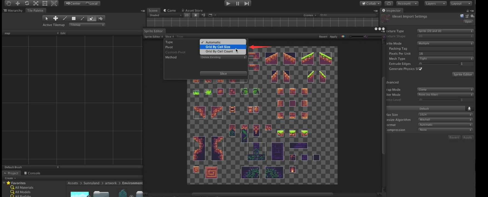

# Unity&小狐狸制作

- 主体页面

  - Project - 文件目录

    位于default界面的的正下方，可以存放各种素材

  - Scene  -游戏画面

    每一个场景

  - Game-游戏

    实操游戏

- 素材获取
  - asset store - 素材商店
    通过asset store，可以下载所需要的素材

- 单元

  单元(Unit)是指每个方格里面有多少个像素点，此次制作我们选择**16**的单元，单元是对于素材所修改的

- 网格

  在创建(+)中找到2D对象中的瓦片地图选择矩形则可以**出现以设置像素为单位的网格**，效果图如下

- 取消显示

  选中scene中任意一个对象，选中如下图，则会隐藏目标

- 切割

  - 平铺调色板

    在***窗口***中移动到2D即可找到***调色面板***

  - 待切割图像

    将待切割图像的像素设置成需要的像素大小

    选中待切割图像在sprite mode调成multiple，并设置需要切割的像素大小，我们可以获得想要切割的部分，如图

    

    我们如果想要细分每个单元的话我们需要在转跳出来的页面选择切割，并且如图，我们可以获得每个切割图形的的单位像素

    

    在调用出的***调色面板***中将所需要切割的图像拖拽到***调色面板***中

    点击保存

    

